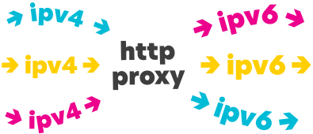

Redirect connections from different ports at one ipv4 address to unique random ipv6 address from \64 subnetwork. Based on 3proxy

## Installation

1. Create a Centos 8 vps with Ipv6 \64 on, VPS from [Vultr *100$ free*](https://www.vultr.com/?ref=8815005-6G) used as Centos setup. ssh into it as root with the password from vultr

2. Run the init script: `bash <(curl -s "https://raw.githubusercontent.com/productmoney/v63proxy/main/scripts/init.sh")`

3. Log out, then log back in

4. Run the setup script, to use password auth `bash <(curl -s "https://raw.githubusercontent.com/productmoney/v63proxy/main/scripts/install_password.sh")` or to use IP auth **NOT DONE YET** `bash <(curl -s "https://raw.githubusercontent.com/productmoney/v63proxy/main/scripts/install_ipauth.sh")`

5. After installation dowload the file `proxy.zip`
   * File structure: `IP4:PORT:LOGIN:PASS`
   * You can use this online [util](http://buyproxies.org/panel/format.php
) to change proxy format as you like

## Administering the script
* Proxy list: `/root/proxy-installer/proxy.txt`
* Active config at: `/etc/3proxy/3proxy.cfg`
* Config template /etc/rc.local writes: `/root/proxy-installer/3proxy.cfg`
* To start proxy: `bash /etc/rc.local`
* To stop proxy: `killall 3proxy`
* To rotate proxies `bash <(curl -s "https://raw.githubusercontent.com/productmoney/v63proxy/main/scripts/cleanup.sh")` and then run the script you want to install with again
* Log at: `tail -n 30 /var/log/3proxy.log`

## Test your proxy

Install [FoxyProxy](https://addons.mozilla.org/en-US/firefox/addon/foxyproxy-standard/) in Firefox

Open [ipv6-test.com](http://ipv6-test.com/) and check your connection

